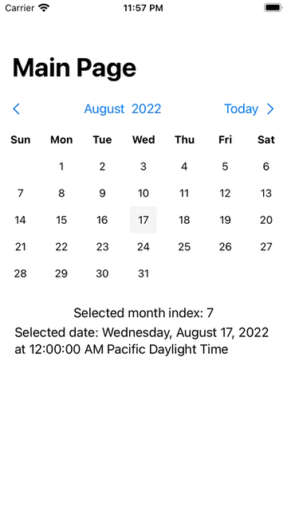

# DeadSimpleCalendar

Package provides a CalendarView which can be used to display simple calendar in your App.

You'd have to pass `getEventsNumber` and `perform` functions which will be used to:
  * `getEventsNumbers(Date?)` - will be called for each date cell for currently displaying month
  * `perform(Date)` - will be called on tap of date cell
  * `monthChanged(Int)` - will be changed when month is scrolled (i.e. changed)

Calendar gets events only for selected month - so if your view model depends on month, use `monthChanged` to update data

# Usage


```swift
import DeadSimpleCalendar

// makeMockData() creates random number of events through provided year -> 2021
// number of events for day will change highlighting of cell
let mockEvents = DeadSimpleCalendar.makeMockData()
    
struct YourDeadSimpleCalendarView: View {
    
    
    // selected date (when user taps on date)
    @State private var selectedDate: Date = Date()
    
    // selected month index (0 -> Jan, 11 -> Dec)
    @State private var selectedMonth: Int = 0
    
    var body: some View {
        let currentYear = DeadSimpleCalendar.getYearFromDate(Date())
        VStack{
            CalendarView(
                getEventsNumber: { date in
                    guard date != nil else { return 0 }

                    if let item = mockEvents[date!] {
                        return item
                    }
                    
                    return 0
                },
                perform: { d in
                    selectedDate = d
                },
                monthChanged: { month in
                    // can be used to update viewModel to query data for selected month
                    selectedMonth = month
                },
                configuration: DeadSimpleCalendarConfiguration(yearRange: (currentYear - 5)...(currentYear + 5))
            )//.border(Color.black)

            VStack(spacing: 5){
                Text("Selected month index: \(selectedMonth)")
                Text("Selected date: \(selectedDate)")
            }.padding()
            Spacer()
        }
    }
}

struct YourDeadSimpleCalendarView_Previews: PreviewProvider {
    static var previews: some View {
        YourDeadSimpleCalendarView()
    }
}

```

## Configuration

You can pass different configruration(`DeadSimpleCalendarConfiguration`) to CalendarView. For now it supports only `yearRange` for "year" selection picker. In future I'm thinking to manage style through this struct as well.

## Demo




